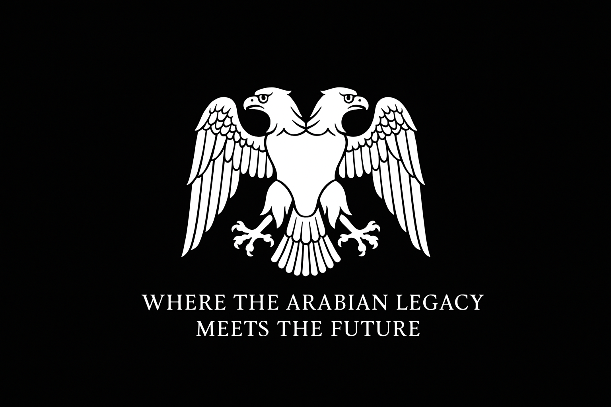
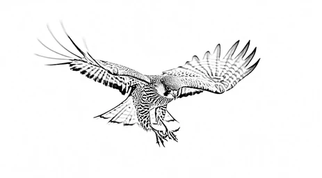
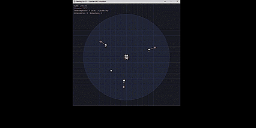

# SQ-7 Hawksgrip

<p align="center">
  
</p>

<p align="center">
  
</p>

<p align="center">
  <strong>TitanGate Inc.</strong><br>
  <em>Where the Arabian Legacy Meets the Future</em>
</p>

<p align="center">
  
  
  
  
</p>

---

## About

**SQ-7 Hawksgrip** — *"The Queen of the High Sky"* — is a distributed autonomous Counter-UAS defense framework designed to protect critical infrastructure against hostile drone threats.

The system employs a coordinated swarm of AI-powered interceptor drones commanded by a persistent airborne mothership node, using auction-based task allocation for optimal threat response.

---

## Demo

<p align="center">
  
</p>

<p align="center">
  <em>Real-time interception of multiple hostile drones using auction-based swarm coordination</em>
</p>

---

## The Problem

The 2019 Aramco attacks exposed a critical vulnerability: traditional air defense systems are economically unsustainable against cheap drone swarms.

| Defense System | Cost Per Engagement |
|----------------|---------------------|
| Patriot PAC-3 | $3,000,000 |
| Stinger MANPADS | $500,000 |
| Directed Energy | $48,000 |
| **SQ-7 Hawksgrip** | **$2,000** |

**Hawksgrip is 17× cheaper than conventional systems.**

---

## The Solution

<p align="center">
  
  
  
</p>

- **Mothership Node** — Airborne command platform with multi-sensor detection
- **Interceptor Swarm** — 6 drones in butterfly formation, expendable design
- **Auction Protocol** — Real-time bid-based target assignment
- **Lead Pursuit** — Predictive navigation for optimal interception

---

## System Architecture

```
                         ┌─────────────────┐
                         │   MOTHERSHIP    │
                         │    "Queen"      │
                         │  Detection &    │
                         │  Command Node   │
                         └────────┬────────┘
                                  │
              ┌───────────────────┼───────────────────┐
              │                   │                   │
       ┌──────┴──────┐     ┌──────┴──────┐     ┌──────┴──────┐
       │ Lead Pair   │     │ Flank Pair  │     │ Rear Pair   │
       │  ◆     ◆    │     │  ◆     ◆    │     │  ◆     ◆    │
       └─────────────┘     └─────────────┘     └─────────────┘
              
                      BUTTERFLY FORMATION
```

---

## Quick Start

### Installation

```bash
git clone https://github.com/kaiseer1/SQ-7-hawksgrip.git
cd SQ-7-hawksgrip
pip install pygame
```

### Run Simulation

```bash
# Single threat
python main.py

# Multi-threat scenario
python main.py --threats 3

# Stress test
python main.py --threats 5

# Headless mode (no graphics)
python main.py --headless --threats 3
```

### Controls

| Key | Action |
|-----|--------|
| ESC | Quit |

---

## Scoring System

| Event | Points |
|-------|--------|
| Successful intercept | +100 |
| Perfect defense (no breaches) | +100 |
| Threat breach | -500 |
| Time (per second) | -0.3 |
| Extra interceptor used | -20 |

---

## Project Structure

```
SQ-7-hawksgrip/
├── main.py                 # Entry point
├── config.py               # Configuration
├── agents/
│   ├── mothership.py       # Command node
│   ├── interceptor.py      # Pursuit drones
│   └── threat.py           # Hostile UAVs
├── systems/
│   ├── auction.py          # Bid-based assignment
│   ├── formation.py        # Butterfly formation
│   ├── intercept.py        # Pursuit logic
│   └── scoring.py          # Reward system
├── environment/
│   └── world.py            # Simulation space
├── visualization/
│   └── renderer.py         # Pygame display
└── utils/
    └── math_utils.py       # Vector math
```

---

## Vision 2030 Alignment

<p align="center">
  
</p>

| Objective | Hawksgrip Contribution |
|-----------|------------------------|
| Defense Localization | Domestic manufacturing capability |
| Technology Transfer | Saudi engineering expertise |
| Economic Diversification | Defense export potential |
| Job Creation | Technical workforce development |

### Target Markets

- 🛡️ National Defense Agencies
- 🏭 Critical Infrastructure (Oil, Airports, Power)
- 🏛️ Government Security
- 🌍 GCC Export (UAE, Qatar, Africa)

---

## Roadmap

| Version | Features | Status |
|---------|----------|--------|
| v0.1 | Core simulation, visualization, auction system | ✅ Complete |
| v0.2 | Zoom controls, threat waves, pause/speed | 🔜 Planned |
| v0.3 | Evasive threats, mesh resilience | 📋 Planned |
| v1.0 | Hardware-in-the-loop validation | 🔮 Future |

---

## Research Paper

> **SQ-7 Hawksgrip: A Distributed AI-Powered Autonomous Counter-UAS Framework with Mesh Coordination and Threat Prioritization**
>
> *Basil Abdullah Alzahrani*  
> Department of Management Information Systems  
> Al Baha University, Kingdom of Saudi Arabia

---

## Author

<p align="center">
  <strong>Basil Abdullah Alzahrani</strong><br>
  Founder & Lead Developer<br>
  <br>
  <strong>TitanGate Inc.</strong><br>
  Al Baha, Kingdom of Saudi Arabia<br>
  <br>
  📧 444019967@stu.bu.edu.sa
</p>

---

## License

Apache License 2.0 — See [LICENSE](LICENSE) for details.

---

<p align="center">
  <strong>حيث يلتقي الإرث العربي بالمستقبل</strong><br>
  <em>Where the Arabian Legacy Meets the Future</em>
</p>
